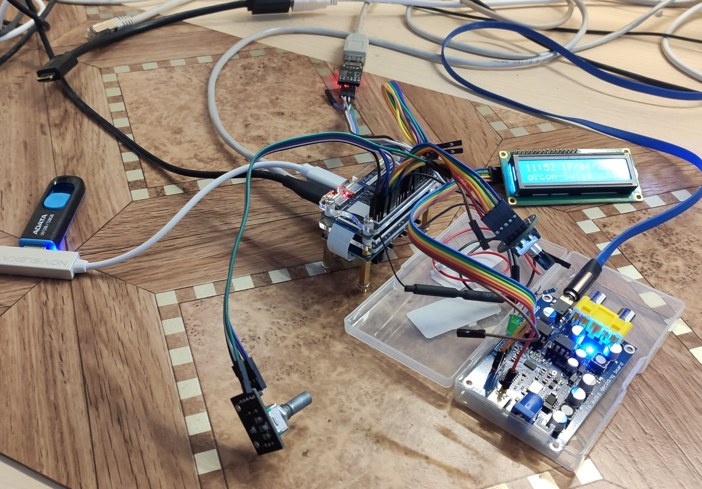
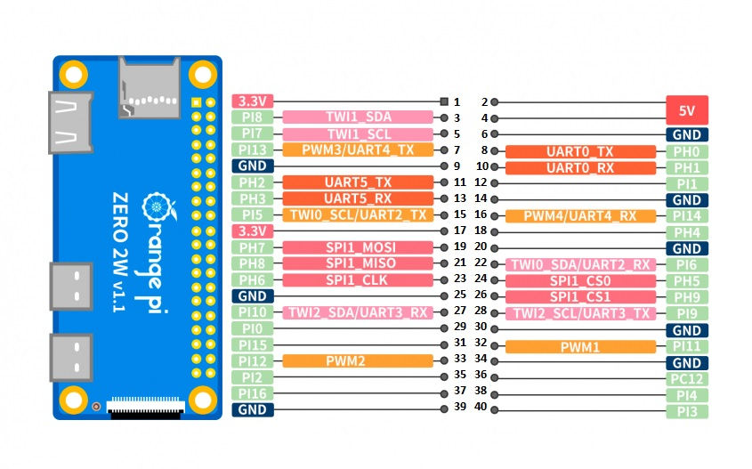
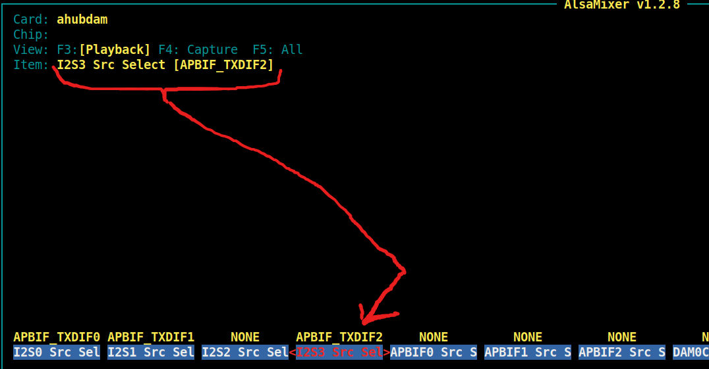

[README_ORIGINAL](README_ORIGINAL.md)

Internet Radio for Orange Pi Zero 2w adopted from Raspberry Pi code

This is a quick and dirty adaptation of code, done with the help of AI.

## Thanks to Bob Rathbone for his [project](https://github.com/bobrathbone/piradio6).

-------------------------------

## 1) выбор дистрибутива

я попробовал несколько, для наших целей наиболее удачный, Ububtu Server - kernel 6.1.31

переходим по ссылке

[Orange-Pi-Zero-2W](http://www.orangepi.org/html/hardWare/computerAndMicrocontrollers/service-and-support/Orange-Pi-Zero-2W.html)

выбираем Ububtu Image - кнопка [download](https://drive.google.com/drive/folders/1g806xyPnVFyM8Dz_6wAWeoTzaDg3PH4Z)

скачиваем "Linux6.1 kernel version image" 

скачаеться несколько архивов вида "Linux6.1 kernel version image-20260417T054039Z-3-ХХХ.zip" - 6 архивов 001-006

в них находим нужный нам образ, server для оперативной памяти 1-2 гигабайт, если же у вас платка на 4 гига, то соответствующий 

-------------------------------

## 2) переводим OS на запуск с внешней USB Flash

Записываем на microSD, загружаемся, поднимаем сеть, далее из под root:

~~~
apt update && sudo apt upgrade -y
reboot
~~~

После прерзагрузки - проверяем SPI flash:
~~~
cat /proc/mtd
#должно быть что то такое:
dev:    size   erasesize  name
mtd0: 00200000 00001000 "spi0.0"
~~~

вторая проверка:
~~~
ls -l /dev/mtd*
#должно быть что то такое:
crw------- 1 root root 90, 0 Apr 17 19:34 /dev/mtd0 
crw------- 1 root root 90, 1 Apr 17 19:34 /dev/mtd0ro 
brw-rw---- 1 root disk 31, 0 Apr 17 19:34 /dev/mtdblock0

/dev/mtd/
total 0 
drwxr-xr-x 2 root root 60 Apr 17 19:34 by-name
~~~

Если вы видите /dev/mtd0 или /dev/mtd/by-name/spi0.0, то можно сделать U-Boot образ и записать на SPI flash.

Сначала делаем пустой образ
~~~
dd if=/dev/zero count=2048 bs=1K | tr '\000' '\377' > spi.img
~~~

потом, записываем в него U-Boot
~~~
dd if=/usr/lib/linux-u-boot-next-orangepizero2w_1.0.4_arm64/u-boot-sunxi-with-spl.bin of=spi.img bs=1k conv=notrunc
~~~

установим mtd-utils
~~~
apt install mtd-utils
~~~

сохраним flash на всякий
~~~
dd if=/dev/mtd0 of=spi_orig.img bs=1K
~~~

Запишем image в SPI-Flash
~~~
flashcp -v spi.img /dev/mtd0 
~~~

Далее подключаем USB-Flash, либо ещё можно SSD по USB,
подключаеться это всё в type-c порт, что рядом с портом питания, - через USB Хаб,
(я пробовал подключать в порты USB платы расширения - там не работает загрузка!)

запускаем
~~~
nand-sata-install
~~~

выбираем там 2 пункт (а по номеру 4 пункт) - "4  Boot from SPI  - system on SATA, USB or NVMe"
 .. далее наш диск и т.д. (файловую систему я выбрал ext4)

скрипт nand-sata-install всё сделает, потом предложит выключить 
- выключаемся и вынимаем microSD карту...

включаем, запуск происходит с USB устройства!

-------------------------------

~~~
sudo -i
apt install git
git clone https://github.com/nvv13/piradio6.git
mv ~/piradio6 /usr/share/radio
~~~

## 3) подключаем внешний DAC по шине I2S, тестируем

как я понял, нам нужен i2s3

i2s3 - можно использоватьчерез контакты
~~~
      40 pin connector
H_I2S3_MCLK   -> PH5 -> 24 
H_I2S3_BCLK   -> PH6 -> 23
H_I2S3_LRCK   -> PH7 -> 19
H_I2S3_DOUT0  -> PH8 -> 21
H_I2S3_DIN0   -> PH9 -> 26
~~~

например для PCM5102a (я подключал PCM5102a и "es9038q2m Rod Rain Audio", и то и другое работает)
~~~
|I2S DAC    | 40 pin connector Orange Pi Zero 2w
-------------------------------------------------
|FSCLK(LRCK) - 19
|DATA (DIN)  - 21
|BCLK (BCK)  - 23
|gnd         - 25(gnd)
|5V          - 2 (5V)
-------------------------------------------------
~~~

включаем i2s3

из проекта [Opi_Zero_3_I2S3_6.1](https://github.com/elkoni/Opi_Zero_3_I2S3_6.1)

[или отсюда](device/Opi_Zero_3_I2S3_6.1)

берем файл sun50i-h616-i2s3_v2.dts

добавляем, комманда:
~~~
# orangepi-add-overlay sun50i-h616-i2s3_v2.dts
~~~

в файле 

/boot/orangepiEnv.txt

должна появится строчка

user_overlays=sun50i-h616-i2s3_v2

перезагружаемся
~~~
reboot
~~~

далее

~~~
alsamixer
~~~

настроить вход миксера как на картинке

тест
~~~
aplay -D hw:1,0 /usr/share/sounds/alsa/audio.wav
~~~

-------------------------------

## 4) установка mpd и mpc, настройка, тест

~~~
apt install mpd mpc
~~~

mpd включаем в автозагрузку
~~~
systemctl enabled mpd
~~~

и в его файлике настроек /etc/mpd.conf прописываем audio выход

вида (device указываем тот который определили)
~~~
audio_output {
	type		"alsa"
	name		"My ALSA Device"
	device		"hw:1,0"	
	mixer_type	"software"	

если звук "заторможен" то добавить (это даже сработало для 32 битной карты, драйвер наверно?) мне пришлось добавить
    format        "44100:16:2"      # <--- РЕШЕНИЕ: Явно задаем частоту 44.1 кГц, 16 бит, стерео
    auto_resample "no"              # Отключаем авто-передискретизацию
    auto_format   "no"              # Отключаем авто-подбор формата

~~~

запускаем mpd
~~~
systemctl start mpd
~~~

загружаем playlist

допустим это файл Radio.m3u - по формату это то же что использует проигрыватель WinAmp 

ложим его в директорию /var/lib/mpd/playlists

грузим
~~~
mpc load Radio
~~~

играем 1 станцию
~~~
mpc play 1 
~~~

-------------------------------

## 5) начальный конфиг, подключение дисплея по i2c, энкодеров, ir-датчик

-------------------------------

## 6) установка Bob Rathbone радио с изменениями для Orange Pi Zero 2w, настройка...

-------------------------------

1********

Шаг 2: Установите Python-библиотеку глобально

Теперь установите саму библиотеку OPi.GPIO-ex с помощью pip3, но без использования виртуального окружения. Флаг --break-system-packages может потребоваться в новых версиях Debian/Ubuntu (на которых основаны ОС для Orange Pi), чтобы разрешить глобальную установку.

Выполните одну из следующих команд:

Вариант А (предпочтительный для новых систем):

sudo pip3 install OPi.GPIO-ex --break-system-packages

*
Важные замечания про глобальную установку

Права доступа: Как уже было сказано, скрипт почти наверняка придется запускать с sudo. Это нормально для работы с GPIO на Orange Pi.

Конфликт версий: Глобальная установка — это самый простой способ "для всего", но он может привести к конфликтам, если у вас есть разные проекты, которым нужны разные версии одной и той же библиотеки. Для серьезных проектов лучше использовать виртуальные окружения (как было описано в прошлом ответе), но тогда и запуск будет чуть сложнее: sudo /путь/к/venv/bin/python3 script.py.

Обновление библиотеки: Чтобы обновить глобально установленную библиотеку до последней версии, используйте:

sudo pip3 install --upgrade OPi.GPIO-ex --break-system-packages

Этот метод позволит вам использовать OPi.GPIO в любом скрипте на вашем Orange Pi, просто импортировав его и запустив с sudo.

1********

2********

Вот несколько способов заменить эту строку во всех файлах в текущей директории (и поддиректориях):

Способ 1: sed + find (самый надёжный)

Эта команда найдёт все .py файлы и заменит строку:

bash

find . -type f -name "*.py" -exec sed -i 's/import RPi\.GPIO as GPIO/import OPi.GPIO as GPIO/g' {} \;

Пояснение:

find . - ищет в текущей директории и всех поддиректориях

-type f - только файлы

-name "*.py" - только файлы с расширением .py

-exec sed -i 's/.../.../g' {} \; - выполняет замену в каждом найденном файле

2********

3********

i2c на пинах 3 и 5 Raspberi PI

чему соответствует для Orange pi zero 2w

На Orange Pi Zero 2W пины 3 и 5, которые на Raspberry Pi используются для шины I2C1 (SDA/SCL), соответствуют другой шине I2C и другим физическим выводам. Вам нужно будет переподключить ваше устройство.

Вот точное соответствие:

🧐 Сравнение распиновки: Raspberry Pi vs Orange Pi Zero 2W
Номер пиФункция на плате (СигналФункция в системНомер GPIO (для кода)
RaspberrSDA (I2CGPIO 2
RaspberrSCL (I2CGPIO 3
Orange Pi Zero 2TWI1-SDAPI8 (GPIO 264) 
Orange Pi Zero 2TWI1-SCLPI7 (GPIO 263) 
Таблица физических пинов: TWI1-SDA и TWI1-SCL — это названия на самой плате для I2C1 .

Таблица системных функций: i2c1 — это название драйвера в Linux, соответствующий этой паре пинов .

💡 Что это значит для вас и ваших действий
Для скетчей/скриптов: Хотя в коде вы также будете обращаться к /dev/i2c-1 (как и на Raspberry Pi), в некоторых библиотеках на Orange Pi может потребоваться указать номера GPIO (PI8, PI7) вместо стандартных 2 и 3. Это зависит от используемой библиотеки OPi.GPIO.

Для подключения: Если у вас есть переходник или шлейф, разработанный для Raspberry Pi, он не будет работать на Orange Pi без переделки, так как расположение сигналов I2C на 3 и 5 пинах физически другое.

Рекомендация: Для упрощения жизни всегда старайтесь подключать I2C-устройства к пинам 3 (SDA) и 5 (SCL) вашего Orange Pi — они уже настроены на I2C1 в большинстве готовых образов систем. Это будет наиболее близким аналогом Raspberry Pi.

🔧 Проверка и активация I2C
Чтобы убедиться, что I2C работает на этих пинах, выполните в терминале:

Установите инструменты (если не установлены):

bash
sudo apt update && sudo apt install -y i2c-tools
Проверьте шину 1 (именно она соответствует 3 и 5 пинам):

bash
sudo i2cdetect -y 1
Если вы увидите адреса (например, 0x3c для OLED-экрана), значит всё настроено верно.

Если шина i2c-1 не отображается, её нужно включить. На Orange Pi это делается через специальный конфигуратор:

bash
sudo orangepi-config
Выберите System -> Hardware.

Стрелками дойдите до строки pi-i2c1
Нажмите Пробел, чтобы поставить галочку (включить).
Нажмите Save, затем Reboot, чтобы перезагрузить плату .

это соответствует orangepiEnv.txt
overlays=pi-i2c1

root@orangepizero2w:~# i2cdetect -l
i2c     mv64xxx_i2c adapter     I2C adapter
i2c     DesignWare HDMI         I2C adapter
i2c     mv64xxx_i2c adapter     I2C adapter
i2c     mv64xxx_i2c adapter     I2C adapter
root@orangepizero2w:~#

root@orangepizero2w:~# sudo cat /sys/kernel/debug/pinctrl/300b000.pinctrl/pinmux-pins | grep -E "i2c"
pin 10 (PA10): device 5002c00.i2c function i2c3 group PA10
pin 11 (PA11): device 5002c00.i2c function i2c3 group PA11
pin 263 (PI7): device 5002400.i2c function i2c1 group PI7
pin 264 (PI8): device 5002400.i2c function i2c1 group PI8
root@orangepizero2w:~#

!!!
/etc/radiod.conf
i2bus=2

!!!
/usr/lib/systemd/system/radiod.service
расскоментировать
Restart=on-failure
RestartSec=5s
!!!иногда возникает ошибка из-за неготовности шины i2c!!!

3********

4********

перепроверить /etc/mpd.conf
поправить

/etc/radiod.conf
audio_config_locked=yes

поправить

4********

5********

sudo orangepi-config
Выберите System -> Hardware.

Стрелками дойдите до строки ir
Нажмите Пробел, чтобы поставить галочку (включить).
Нажмите Save, затем Reboot, чтобы перезагрузить плату .

orangepiEnv.txt уже будет
overlays=ir pi-i2c1

после перезагрузки, проверяем
root@orangepizero2w:/boot# ls -la /dev/lirc*
crw-rw---- 1 root video 243, 0 Apr 10 14:08 /dev/lirc0
root@orangepizero2w:/boot# 

далее
apt install evtest

для теста кнопок на пульте, или 
root@orangepizero2w:~# cat /dev/lirc0

apt install lirc -y

/etc/lirc/lirc_options.conf надо
driver = default
device = /dev/lirc0

sudo systemctl restart lircd

Проверьте сырой сигнал с приемника:
sudo mode2 -d /dev/lirc0

# Проверьте, запущен ли процесс lircd
ps aux | grep lircd

# Проверьте, какие файлы открыл процесс
sudo lsof -p $(cat /var/run/lirc/lircd.pid) 2>/dev/null | grep -E "lirc|sock"

output = /run/lirc/lircd

все с 
systemctl disable lircd
---

ставим
apt install ir-keytable triggerhappy

проверка, нажимаем на лентяйку
sudo ir-keytable -c -p NEC -t

лучьше так
 табл лентяйки
sudo nano /etc/rc_keymaps/myremote.toml
 грузим
sudo ir-keytable -c -w /etc/rc_keymaps/my_remote.toml
 тест сразу с названиям клавиш
sudo ir-keytable -t

apt install python3-evdev -y

/usr/share/radio/ireventd.py
поменял gpio_ir_reciv на sunxi-ir

а где то на sunxi_cir

+добавил
GPIO.setmode(GPIO.BOARD)
перед установки режима OUT для remote_led
теперь это соответствует контактам на 40 пин разьеме, в конфиге указал
remote_led=12

далее включил и запустил сервис ireventd

5********

6********

rotary_class.py

поменять
GPIO.setmode(GPIO.BCM)
на
GPIO.setmode(GPIO.BOARD)
теперь это соответствует контактам на 40 пин разьеме, в конфиге указал

во всех файлах поменял
~~~
find . -type f -name "*.py" -exec sed -i 's/GPIO\.setmode(GPIO\.BCM)/GPIO.setmode(GPIO.BOARD)/g' {} \;
~~~

~~~
# Set the user interface to 'buttons' or 'rotary_encoder' or 'graphical'
# These can also be used in conjunction with a graphical/touchscreen display
user_interface=rotary_encoder

# Switch settings for Rotary encoders or buttons
menu_switch=33
mute_switch=29
up_switch=37
down_switch=36
left_switch=31
right_switch=32
~~~

что соответств (1 колонка № контакта на 40 пин разьеме)
~~~
29 Mute volKnob Switch (SW)
31 Volume up/down Output A 
32 Volume up/down Output B (DT)

33 Menu swiKnob Switch (SW)
36 Channel Output A (CLK)
37 Channel Output B (DT)
~~~

6********

